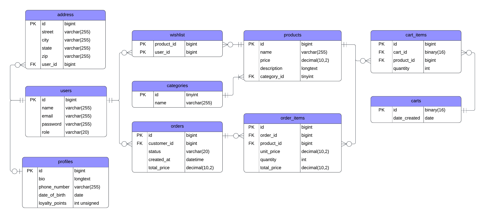

# Online Store Backend

## Overview

A fully featured e-commerce backend built with Spring Boot, Spring Security, and Stripe, implementing modern RESTful design principles, JWT authentication, validation, and payment workflows.
Developed as part of Mosh Hamedani’s [“Spring Boot: Building APIs – Part 2” course](https://codewithmosh.com/p/spring-boot-building-apis), this project demonstrates production-grade backend architecture, clean code design, and cloud deployment.

Improvements: 

- Added `Dockerfile`, `docker-compose.yaml`, `application-docker.yaml` to enable running the app with Docker 
- Published a multi-architecture Docker image (ARM64 and AMD64 version) to [docker hub](https://hub.docker.com/repository/docker/yamchips/store/general) for easy deployment 

## Database Design

The following ER diagram presents the core domain model of the system, covering users, products, carts, orders, order items, and wishlists.

It captures key relationships, cardinalities, and optional associations, including the use of join tables to model many-to-many interactions.



## Features

### API design

- REST APIs for products, users, shopping carts, and orders
- DTOs + MapStruct for clean data transfer and separation of concerns
- Jakarta Validation for strong request validation with custom annotations
- Global exception handling with detailed error messages and HTTP codes
- Swagger UI integration for live, interactive API documentation

### Authentication & Authorization

- Stateless JWT-based authentication
- Access and refresh tokens with configurable expiry
- Role-based access control for USER and ADMIN
- Password hashing with BCryptPasswordEncoder
- Secure secret and key management using .env and Spring Dotenv

### Shopping Cart & Orders

- UUID-based cart system for secure and unique identifiers
- APIs for adding, updating, removing, and clearing cart items
- Automatic total price calculation per cart and per item
- Rich domain design — cart and order entities encapsulate their own logic
- Seamless checkout flow that converts a cart to an order
- EntityGraph + JPQL used to eliminate N+1 queries for performance

### Payment Integration

- Stripe Checkout for real-world payment processing
- Webhook endpoint to receive Stripe payment events
- Auto-updates order status on successful payments
- Decoupled payment layer via PaymentGateway interface (future PayPal integration possible)
- Transactional handling with robust error control

### Postman Testing

- Organized collection includes Auth, Product, Cart, and Order folder
- Use global variables such as baseUrl, accessToken, refreshToken, and cartId
- Profile-based configuration (dev / prod) for environment isolation

### Additional Highlights

- Modularized Spring Security rules for maintainability
- Global Flyway migrations for database versioning
- Cloud deployment on Railway with managed MySQL

## Tech Stack

| Category   | Technologies                                               |
|------------|------------------------------------------------------------|
| Language   | Java 17                                                    |
| Build tool | Maven                                                      |
| Framework  | Sping Boot 3, Spring Web, Spring Security, Spring Data JPA |
| Database   | MySQL                                                      |
| Mapping    | MapStruct                                                  |
| Validation | Jakarta Validation                                         |
| Auth       | JWT                                                        |
| Payment    | Stripe                                                     |
| Deployment | Railway                                                    |
| Docs       | Swagger                                                    |

## Endpoints

### Users endpoint

| Method | Endpoint                    | Description                 |
|--------|-----------------------------|-----------------------------|
| GET    | /users                      | Get all users               |
| GET    | /users/{id}                 | Get the user given an id    |
| POST   | /users                      | Create a user               |
| PUT    | /users/{id}                 | Update the user given an id |
| DELETE | /users/{id}                 | Delete the user given an id |
| POST   | /users/{id}/change-password | Change the user's password  |

### Products endpoint

| Method | Endpoint       | Description                    |
|--------|----------------|--------------------------------|
| GET    | /products      | Get all products               |
| GET    | /products/{id} | Get the product given an id    |
| POST   | /products      | Create a product               |
| PUT    | /products/{id} | Update the product given an id |
| DELETE | /products/{id} | Delete the product given an id |


### Carts endpoint

| Method | Endpoint                          | Description                                    |
|--------|-----------------------------------|------------------------------------------------|
| POST   | /carts                            | Create a cart                                  |
| POST   | /carts/{cartId}/items             | Add a product to the cart                      |
| GET    | /carts/{cartId}                   | Get the cart given an id                       |
| PUT    | /carts/{cartId}/items/{productId} | Update the quantity of the product in the cart |
| DELETE | /carts/{cartId}/items/{productId} | Delete the product in the cart                 |
| DELETE | /carts/{cartId}/items             | Clear cart given an id                         |

### Orders endpoint

| Method | Endpoint          | Description                |
|--------|-------------------|----------------------------|
| GET    | /orders           | Get all orders             |
| GET    | /orders/{orderId} | Get one order given an id  |

### Checkout endpoint

| Method | Endpoint          | Description                    |
|--------|-------------------|--------------------------------|
| POST   | /checkout         | Create a checkout request      |
| POST   | /checkout/webhook | Deal with event sent by Stripe |

### Auth endpoint

| Method | Endpoint      | Description                  |
|--------|---------------|------------------------------|
| POST   | /auth/login   | Handle login request         |
| POST   | /auth/refresh | Handle refresh token request |
| GET    | /auth/me      | Get current login user       |

### Example API Flow

Here is a sample flow to help you understand how to interact with the API after starting the application.

1. Get all products

`GET /products`

The database is automatically populated with 10 sample products.

2. Create a shopping cart

`POST /carts`

This will return the cart ID. You don't need to be logged in to create a cart.

3. Add items to cart

Once you have a cart ID, you can add products by sending:

`POST /carts/{cartId}/items`

Request body example:

```
{
    "productId": 1
}
```

4. Register a new user

To check out, you have to register and login first:

`POST /users`

Request body example:

```
{
    "name": "Harry Potter",
    "email": "harry@gmail.com",
    "password": "123456"
}
```

5. Login to get an access token

Hit this endpoint:

`POST /auth/login`

Request body example:

```
{
    "email": "harry@gmail.com",
    "password": "123456"
}
```

6. Checkout

After login, you can check out by hitting this endpoint:

`POST /checkout`

Headers example:

`Authorization: Bearer json-web-token`

Request body example:

```
{
    "cartId": "target-cart-id"
}
```

The response contains a Stripe checkout URL. Open it in the browser to complete the payment using a test card:

```
Card: 4242 4242 4242 4242
Expiry: any future date
CVC: 123
```

7. Webhook & Order status update

Once payment is completed, Stripe will trigger a webhook call to:

`POST /checkout/webhook`

This backend listens for this event and updates the order status in the database accordingly.

## Getting Started

### 1. Clone and Setup

```
git clone https://github.com/yamchips/spring-store-prod
cd spring-store-prod
```

### 2. Configure Environment Variables

Create a `.env` file in the project root, set following variables:
- JWT_SECRET
- STRIPE_SECRET_KEY
- STRIPE_WEBHOOK_SECRET_KEY
- DB_NAME
- DB_USER
- DB_PASSWORD

### 3. Run App

#### 3.1 Run Locally

This is a Maven project. To start the application, run

```
mvn spring-boot:run
```

#### 3.2 Run with Docker Compose

This project includes a `docker-compose.yaml` that starts:
- MySQL database
- Spring Boot application

To start the application using Docker Compose, run

```
docker compose up --build
```

#### 3.3 Ports

Once running, the application will be available at:

```
http://localhost:8080
```

Swagger UI is available at:

```
http://localhost:8080/swagger-ui.html
```

#### 3.4 Stop the Application

To stop all running containers, run

```
docker compose down
```